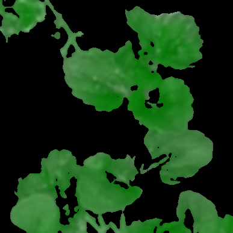

# Graph Based Image Segmentation
### Introduction
With increased reliance on plants for food and fuel, researchers need to use advanced technological methods to allow agricultural practices to continue without any breach. One of the biggest requirement is to increase the efficiency and yield of the crop, with an aim to enhance the throughput from a piece of land. Plant’s growth and yield are directly attributed to the number of leaves it has. Various methods are employed to count the leaves in an image. This report explores the usage of graph-segmentation to extract leaf regions from an image. The method has the advantage of minimal computation time and robustness to external factors such as brightness and contrast, which can affect the results obtained from using ConvNets and other methods. 

### Results
Following are the results Obtained    return




***

### Usage
Download the Repository and Run the following command
```
python main.py -i "path/to/input/image" -o "path/to/output/image" -p "1"
```
